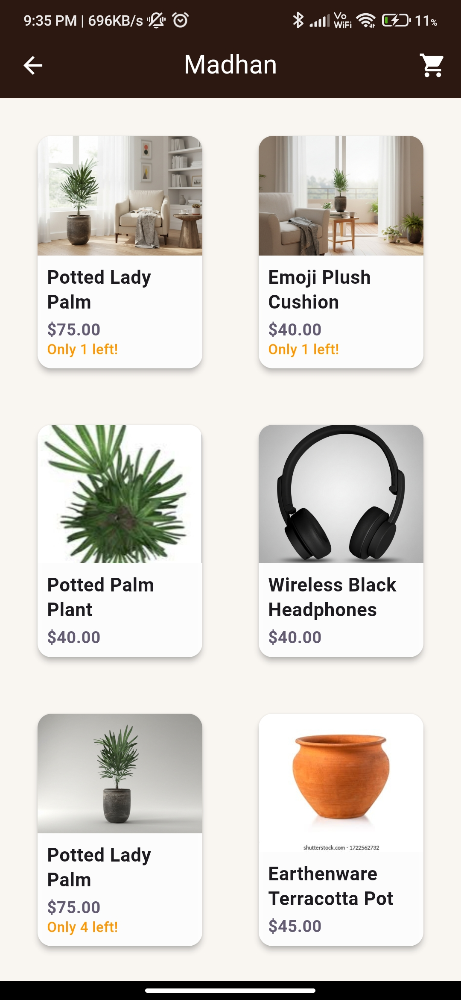
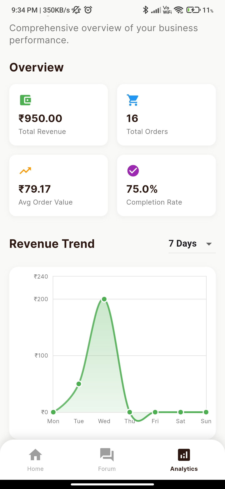

<div align="center">

  

  <h1>Marti</h1>
  <p>Connecting artisans with customers through modern, localized, and AI-assisted commerce.</p>

</div>

<div align="center">
  
  <br />
  <em>Featured: Product Collection — Browse curated artisan products including potted plants, home decor, and handcrafted items with real-time inventory tracking and instant shopping cart access.</em>
</div>

<div align="center">
  <p>
	 <a href="#-features">Features</a> ·
	 <a href="#-quickstart">Quickstart</a> ·
	 <a href="#-buyer-user-flow">Buyer Flow</a> ·
	 <a href="#-seller-user-flow">Seller Flow</a> ·
	 <a href="#-architecture--project-structure">Architecture</a> ·
	 <a href="#-technologies--packages">Technologies</a>
  </p>
</div>

## Overview

Marti is a Flutter app that helps artisans showcase products, tell their stories, and sell to customers seamlessly. It features localized UX, chat, reviews with voice replies, order tracking, notifications, and AI-powered assistance (Firebase AI/Gemini) for rich experiences.

## API
Add your api key in (marti/lib/services/gemini_service.dart) & 

## Screenshots

<div align="center">

  
  
  
  

  <br />

  <p><sub><strong>Craft It:</strong> Custom request form for pottery and handmade items | <strong>Browse:</strong> Google Nano Banana | <strong>Details:</strong> Used to generate production level product photography less than 10 secs | <strong>Cart:</strong> Shopping experience</sub></p>
  <p><sub>UI evolves rapidly; see <code>lib/scripts/</code> for current pages.</sub></p>

</div>

---

## 🚀 Quickstart

### Prerequisites
- Flutter SDK (3.22+ recommended)
- Dart SDK (bundled with Flutter)
- A Firebase project (Firestore, Storage, Authentication, Messaging enabled)
- Android Studio / Xcode tooling (platform builds)

### Clone and install

```powershell
git clone <your-repo-url>
cd Arti
flutter pub get
```

### Configure Firebase
Place your platform configs:
- Android: `android/app/google-services.json`
- iOS: `ios/Runner/GoogleService-Info.plist`

Rules (optional starting points are provided):
- Firestore rules: `firestore.rules` or `firestore_simplified.rules`
- Storage rules: `storage.rules` or `firebase_storage_rules.txt`

### Local assets and keys
- App icon/logo: `assets/images/marti_16_9.png` (already wired; launcher icons generated)
- Optional GCP/AI: `assets/gcp-service-key.json` and `assets/client_secret.json`

### Run the app

```powershell
flutter run
```

To build launcher icons again (already set up):

```powershell
flutter pub run flutter_launcher_icons
```

---

## 📦 Technologies & Packages

Core runtime:
- Flutter, Dart, Provider (`provider`) for state management
- Localization with Flutter gen-l10n (`flutter_localizations`, `intl`)

Firebase integration:
- `firebase_core`, `firebase_auth`, `cloud_firestore`, `firebase_storage`
- `firebase_messaging` for push notifications
- `flutter_local_notifications` for local notifications

Media & device:
- `image_picker`, `cached_network_image`, `video_player`, `audioplayers`
- `record` (audio), `mobile_scanner` (QR/scan), `qr_flutter`

Location & maps:
- `geolocator`, `google_maps_flutter`, `latlong2`

AI & networking:
- `google_generative_ai`, `firebase_ai`, `dio`, `http`

UX & utilities:
- `google_fonts`, `permission_handler`, `shared_preferences`, `file_picker`, `path_provider`, `image`
- Charts & analytics UI: `fl_chart`

All versions are pinned in `pubspec.yaml`. Install via `flutter pub get`.

---

## 🧭 Buyer User Flow

1. Onboarding/Login
	- Choose language, sign in with email/Google (via `login_screen.dart`).
2. Browse & Discover
	- Explore products and artisan stories (`buyer_screen.dart`, `enhanced_product_listing_page.dart`).
3. Product Details
	- View images, descriptions, ratings, and artisan legacy stories (`product_detail_screen.dart`).
4. Cart & Checkout
	- Add to cart (`cart_screen.dart`), proceed to order.
5. Orders & Tracking
	- Follow order status and history (`orders_page.dart`).
6. Chat & Assistance
	- Chat with artisans or use the buyer chatbot (`buyer_chatbot_screen.dart`).
7. Reviews
	- Leave reviews; see artisan text/voice replies.

---

## 🧰 Seller User Flow

1. Onboarding
	- Sign in, complete profile (`seller_profile_screen.dart`).
2. Product Management
	- Create/edit products, manage inventory, media uploads (`product_management_screen.dart`, `add_product_screen.dart`, `edit_product_screen.dart`).
3. Orders
	- Manage incoming orders (`seller_orders_page.dart`, `enhanced_seller_orders_page.dart`).
4. Analytics
	- Track performance and trends (`seller_analytics_screen.dart`).
5. Customer Engagement
	- Respond to chats and reviews with text or voice replies (`product_reviews_management_screen.dart`).
6. Storytelling
	- Craft “Artisan Legacy Story” to deepen buyer trust (`edit_artisan_story_screen.dart`).

---

## 🏗️ Architecture & Project Structure

Principles
- Feature-first screens with clear separation of concerns
- Services + repositories + models for Firebase and integrations
- Provider for app-wide state (locale, auth, data)
- Strong localization via gen-l10n (see `lib/l10n/*.arb`)

Key folders
- `lib/main.dart` – app entry, localization, routing glue
- `lib/models/` – core data models (product, order, review, chat, etc.)
- `lib/screens/` – buyer & seller UIs
- `lib/navigation/` – navigation scaffolding
- `lib/services/` – Firebase, storage, analytics, AI helpers
- `lib/widgets/` – reusable UI components
- `lib/l10n/` – `app_en.arb`, `app_ta.arb`, `app_hi.arb` (localizations)
- `assets/` – images and optional auth/AI keys

Data & backend
- Firebase Auth: user accounts for buyers/sellers
- Firestore: products, orders, chats, reviews, artisan profiles
- Storage: product media, voice replies
- FCM: push notifications

---

## 🌍 Localization

Marti ships with English, Tamil, and Hindi via Flutter gen-l10n.
- ARB files: `lib/l10n/app_*.arb`
- Add new languages by creating `app_<lang>.arb` and running `flutter pub get` (gen-l10n is enabled in `pubspec.yaml`).

---

## 🔔 Notifications

- Push: `firebase_messaging`
- Local: `flutter_local_notifications`
- Navigation from notifications via a global `navigatorKey`

---

## ✅ Benefits

### For Sellers
- Simple product onboarding and inventory management
- Direct chat with buyers, build relationships
- Voice/text replies to reviews for authenticity
- Analytics dashboard to understand performance
- Storytelling tools to showcase heritage and craft

### For Buyers
- Trust via artisan profiles and legacy stories
- Smooth discovery → detail → cart → checkout flow
- Chat with sellers and get quick help via chatbot
- Reviews with voice responses add credibility
- Localized experience in multiple languages

---

## 🛠️ Development Tips

Environment
- Ensure Flutter SDK is installed and on PATH
- On Windows PowerShell, prefer commands listed here

Common commands

```powershell
# Fetch dependencies
flutter pub get

# Run the app on a connected device/emulator
flutter run

# Analyze and format
flutter analyze
flutter format .

# (Re)generate launcher icons
flutter pub run flutter_launcher_icons
```

Maps & APIs
- Add your Google Maps API key per `google_maps_flutter` docs if you use map features.
- AI features can be enabled with `firebase_ai` or `google_generative_ai`; see project docs in `Developer_readme/`.

Security
- Do not commit real production secrets. The files under `assets/` are for local/dev.

---

## 📄 License

This repository is proprietary to its authors/owners. If you plan to open-source, add a license here.

---

## 🙌 Acknowledgments

- Flutter and Firebase communities
- All contributing artisans and early users

